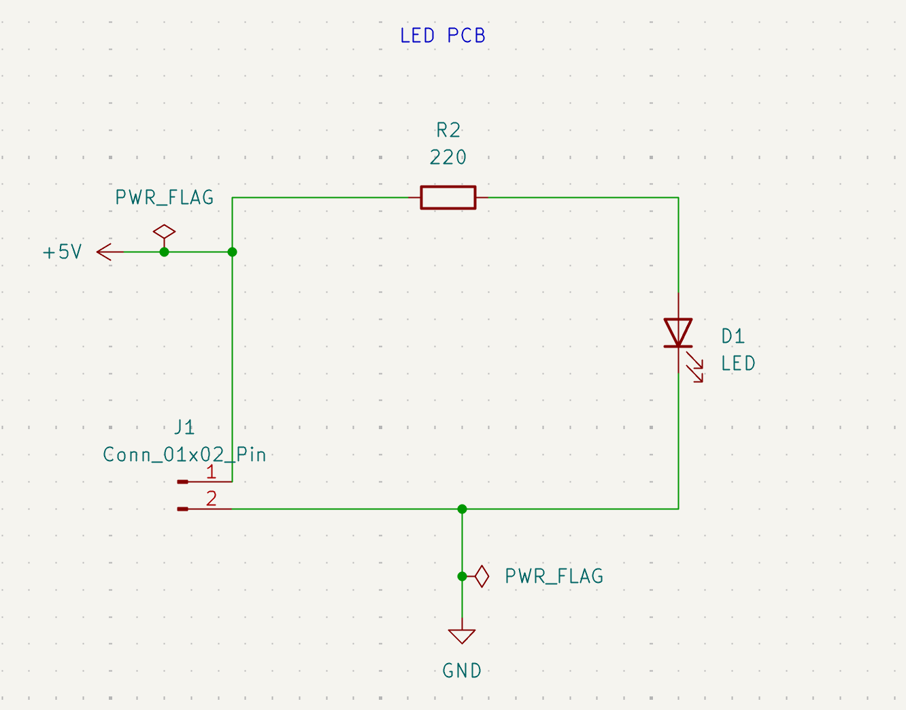
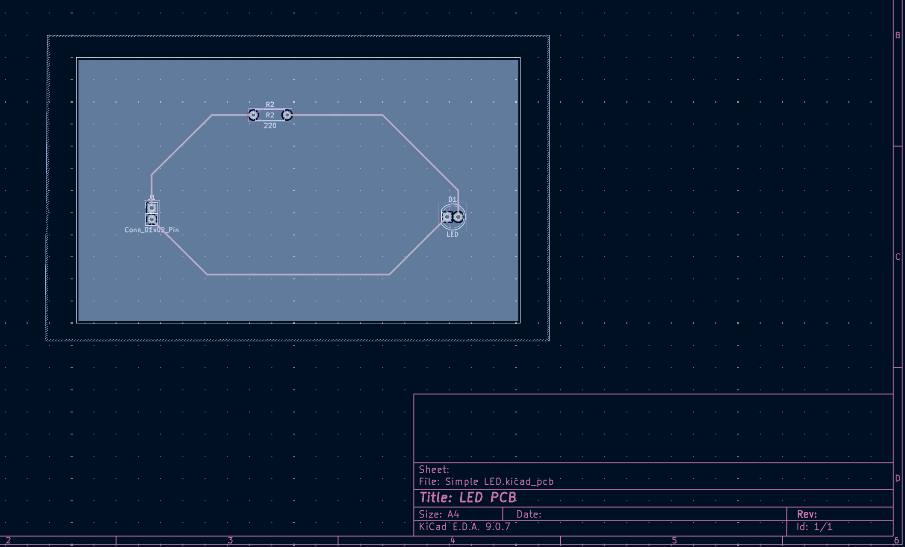
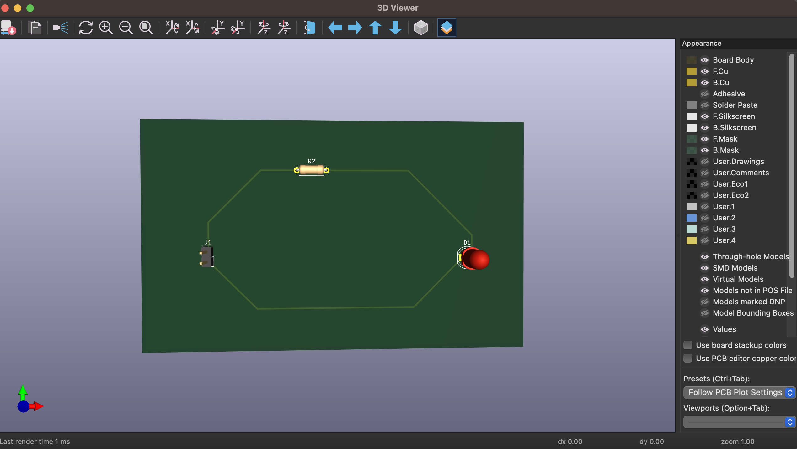

# LED PCB — Simple 5V Circuit with Custom SPICE Model

**Status:** Schematic and PCB designed; LTspice simulation completed; uploaded ERC, DRC, and schematic-parity results show zero reported violations under the configured checks. Manufacturing files exported. Physical assembly and testing pending.







## What This Is

A simple 5V → 220 Ω resistor → red LED → ground circuit, developed to practice circuit calculations, SPICE model fitting, PCB layout, and fabrication-file verification. The diode model is fitted to supplied I–V data whose provenance is not yet documented. Simulation results are predictions, not physical measurements.

## Results

| Parameter | Value | Evidence or qualification |
|-----------|-------|---------------------------|
| Predicted LED current | 14.3515 mA | Saved LTspice operating point |
| Predicted LED voltage | 1.84267 V | Saved LTspice operating point |
| Resistor dissipation | 45.31 mW | Calculated from simulated current using I²R |
| Routed trace width | 0.4 mm (15.75 mil) | PCB source file |
| Copper thickness | 35 µm per side (approximately 1 oz) | Intended fabrication specification in Gerber job file |
| Board dimensions / thickness | 100 × 60 mm / 1.6 mm | PCB outline and board settings |
| ERC / DRC | Zero reported errors and warnings | Uploaded check screenshots; configured exclusions discussed in design notes |
| Schematic-to-PCB parity | Zero differences | Uploaded parity-check screenshot |
| Manufacturing package | Gerbers and Excellon drills | [gerbers.zip](kicad/gerbers.zip) |

## Quick Start

**View the design:** Open [Simple LED.kicad_pro](kicad/Simple%20LED.kicad_pro) in KiCad 9, then open the schematic and PCB from the project manager.

**Run the simulation:** Open [led_circuit.asc](simulation/ltspice/led_circuit.asc) in LTspice and run its `.op` analysis. The complete `led_red` model directive is embedded in that file. See the [saved simulation log](simulation/ltspice/led_circuit.log).

**Run the model fitter:** From the repository root, with NumPy and SciPy installed:

```bash
python3 -m pip install numpy scipy
python3 simulation/python/led_model.py
```

The script prints model directives; it does not write `.lib` files. Changing the reference models in `models/` does not automatically update the model embedded in LTspice.

## Bill of Materials

| Reference | Value | Package / specification | Selection status |
|-----------|-------|-------------------------|------------------|
| R2 | 220 Ω, ¼ W | Axial; footprint `R_Axial_DIN0207_L6.3mm_D2.5mm_P7.62mm_Horizontal` | Select part with compatible body, lead diameter, and bent lead spacing; part number and tolerance pending |
| D1 | Red LED | 5 mm through-hole; 2.54 mm pin spacing | Part number, polarity drawing, and electrical ratings pending |
| J1 | 2-pin header | 2.54 mm pitch; pin 1 = +5V, pin 2 = GND | Manufacturer part number pending |

The resistor is R1 in LTspice and R2 in KiCad. The model identifier is `led_red`; the reference library filename is `red_led.lib`.

## Project Files

| Path | Contents |
|------|----------|
| `kicad/` | Project, schematic, PCB, screenshots, and manufacturing ZIP |
| `simulation/ltspice/` | Circuit with embedded model and operating-point log |
| `simulation/python/led_model.py` | Model fitter |
| `simulation/matlab/led_model.m` | Educational implementation with known limitations |
| `models/` | Reference red and blue model directives |
| `workdir/` | Supplied two-column I–V data at repository root |
| [DESIGN_NOTES.md](DESIGN_NOTES.md) | Design decisions, actual revisions, checks, and fabrication details |
| [SPICE_MODELING.md](SPICE_MODELING.md) | Data, fitting method, fit errors, and model limitations |

## Limitations and Next Steps

- Document the data source, LED identity, measurement method, and temperature. The supplied red-LED point of 0.5 V at 1 mA particularly needs verification.
- Select actual component part numbers and check their datasheets against the footprints and operating conditions.
- Assemble and test the board; measure LED voltage and infer current from the voltage across the measured resistor resistance.
- Compare bench results with predictions before claiming physical validation.

## Tools and Attribution

- KiCad 9.0.7: source/export metadata.
- LTspice 17.2.4: saved simulation log.
- Python fitter independently exercised during documentation review with Python 3.12.14, NumPy 2.3.5, and SciPy 1.17.0. These are review-environment versions, not a claim about the original development environment or all supported versions.

Model-fitting methodology is based on [Ted Yapo's LED modeling project](https://github.com/tedyapo/led-modeling). See [SPICE_MODELING.md](SPICE_MODELING.md) for details and references.

## License

MIT License. See [LICENSE](LICENSE).
